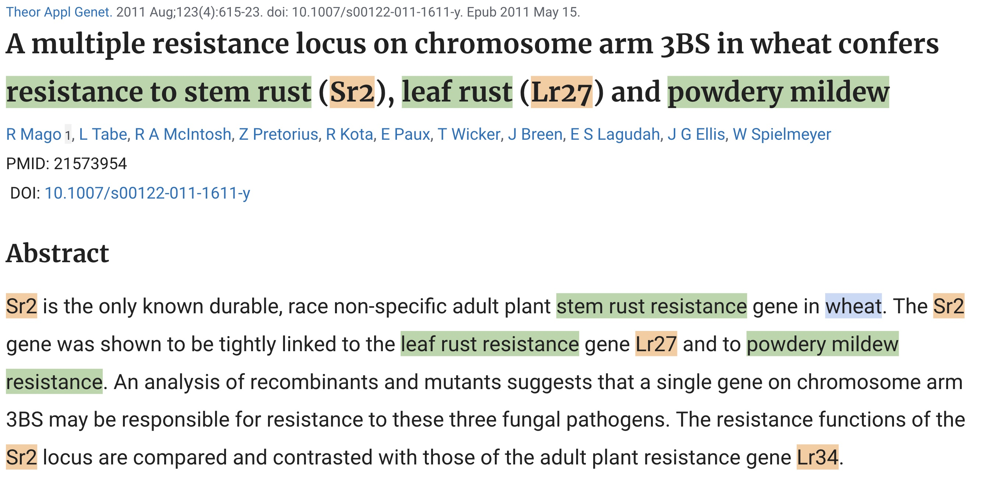

The **Wheat Genomics Scientific Literature KG** (WheatGenomicsSLKG) is a FAIR knowledge graph that exploits the Semantic Web technologies to integrate information about Named Entities (NE) extracted automatically from a corpus of PubMed scientific papers on wheat genetics and genomics.

In this corpus, the PubMed identifier, title and abstract of each publication are provided. In some cases, the abstract of a publication is split in sub-sections. We used the [AlvisNLP]'https://github.com/Bibliome/alvisnlp) pipeline to extract Named entities of types **genes**, **phenotypes**, **taxon names** and **varieties** mentioned in the title and the abstract of publications, and the relationships between wheat mentions of varieties and phenotypes.

The figure below illustrates an example of PubMed publication where three types of NEs are recognised: genes (e.g., __Sr2__, __Lr27__, __Lr34__), phenotypes (e.g., __leaf rust resistance__, __resistance to stem rust__, __powdery mildew resistance__) and taxon name (e.g., __wheat__). 

  

Mentions of phenotype and taxon are linked to existing entities defined respectively in the Wheat Trait Ontology (WTO) and NCBI taxonomy.

## Semantic Data Model 

The core part of the **WheatGenomicsSLKG** data model is based on the [W3C Web Annotation Ontology (OA)](https://www.w3.org/ns/oa)  which has been complemented by different vocabularies to describe documents metadata: 

|Vocabulary | Prefix  | URI |
|--------------| ------------- | ------------- |
|Web Annotation Ontology| oa  | http://www.w3.org/2003/01/geo/wgs84_pos#  |
|Dublin Core Terms | dct | http://www.opengis.net/ont/geosparql# |
|Dublin Core Elements| dce | http://vocab.nerc.ac.uk/collection/P07/current/ |
|FaBiO (FRBR-aligned Bibliographic Ontology)| fabio | http://purl.org/spar/fabio/ |
|Bibliographic Ontology (BIBO)| bibo | http://purl.org/ontology/bibo/  |
|Schema.org| schema | http://schema.org/ |
<!-- |PROVenance Ontology| prov | http://www.w3.org/ns/prov#  |
|Functional Requirements for Bibliographic Record ( FRBR)| frbr | http://purl.org/vocab/frbr/core# |
|DUL ontology  | dul | http://www.ontologydesignpatterns.org/ont/dul/DUL.owl# |
|OntoLex module for Frequency, Attestation and Corpus information (FrAC)| frac | http://www.w3.org/ns/lemon/frac# | -->

## License

The code used to produce the knowledge graph is licensed under the [Apache License 2.0](http://www.apache.org/licenses/LICENSE-2.0).

The RDF data files produced by the code are made available under the terms of the [Open Data Commons Attribution License v1.0](https://opendatacommons.org/licenses/by/1-0/) (ODC-By-1.0) license.
